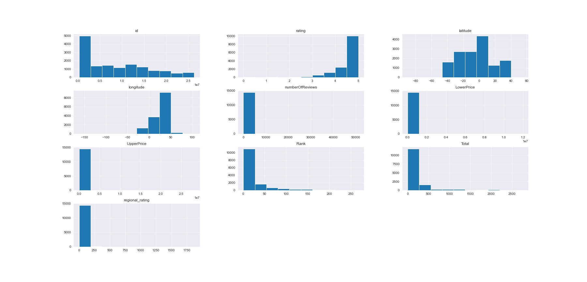
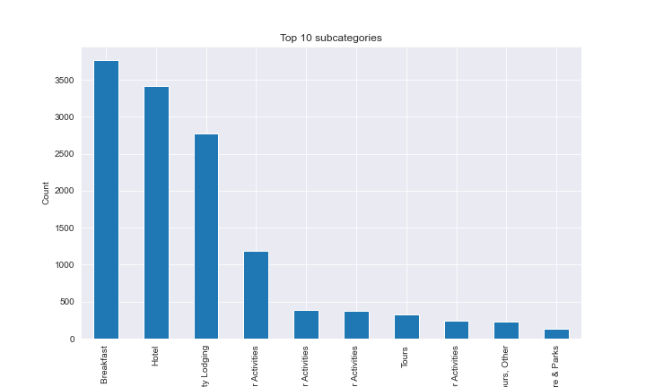

# Africura Travel Destination Recommendation System
A recommendation system that gives users suggestions that best match their travel preferences in and around African countries.
<p>
    
</p>
<p align="center">
    
    
    
    
    
    
    
    
</p>

#### Authors
* [Dennis Mwanzia](https://github.com/DennisMwanzia)
* [Pamela Awino](https://github.com/PamelaAwino)
* [Joshua Rwanda](https://github.com/R3TR0Quan)
* [Nelson Kemboi](https://github.com/nelkemboi)
* [Pauline Wambui](https://github.com/paulineKiarie)
* [Kane Muendo](https://github.com/kanevundi)
* [Ian Macharia](https://github.com/Imacharia)

## Introduction

Tourists visiting Africa often struggle to find suitable travel destinations that align with their preferences, making it challenging to plan a satisfying trip within their budget and time constraints. 

Our main aim as AfricuraAI is to develop a machine learning model i.e. recommendation system that provides personalized recommendations for the best tourist destinations in Africa. By considering customer reviews, budget constraints, specific locations, available amenities, and residence type, the model aims to suggest the ideal tourist destination that aligns with the user's preferences.

## Objective

The goal is to build a machine learning model that can accurately predict hotel ratings based on customer reviews, budget constraints, specific locations, and the type of residence. The model will help users make informed decisions when selecting hotels by considering their preferences and constraints.

## Project Overview

This project followed the CRISP-DM process. The CRISP-DM process is a data mining process model that describes commonly used approaches that data mining experts use to tackle problems. The CRISP-DM process is divided into six phases; Business Understanding, Data Understanding, Data Preparation, Modelling, Evaluation, and Deployment. The following is a brief description of each phase:

- **Business Understanding**: Exploring the business reasons for our data mining effort and what the company hopes to gain from the project.
- **Data Understanding**: The datasets we utilized comprised of json files scraped from tripadvisor.
- **Data Preparation**: It mainly involved; selecting the data to discover the columns to be used, cleaning the data to correct and remove erroneous values, formatting the data to effectively perform mathematical operations and integrating the datasets to create a merged dataset for effective analysis.
- **Exploratory Data Analysis**: The goal of this procedure is to summarize the main characteristics of the dataset, which is often done visually.
- **Modelling**: To further support and provide insight we built a content-based system.
- **Evaluation**: Mean Absolute Error abd Root Mean Squared Error were used to measure the average of absolute deviance between actual and predicted ratings given by users.
- **Recommendation and Conclusion**: It mainly involved interpreting our project findings, offering opinions based on the findings, proposing a solution to the gap discovered in the research that needs to be filled, and the next steps to be undertaken in future analysis.

## Setup Instructions

* Install the required packages using pip:

    ```
    pip install -r requirements.txt
    ```

* Install Streamlit:

    ```
    pip install streamlit
    ```

* To run the app locally run the following on terminal:
    ```
    streamlit run deployment/africura.py
    ```
## Our Data

We sourced data by scraping destination review data from **TripAdvisor** using a popular web scraping tool, [Apify](https://console.apify.com) 
Here's a breakdown of aome of the main columns we used in coming up with recommendations:

* `id`: Unique identifier for each item.
* `type`: Type of the item.
* `category`: Category of the item.
* `subcategories`: Subcategories associated with the item.
* `name`: Name of the item.
* `rankingPosition`: Ranking position of the item.
* `rating`: Rating of the item.
* `rawRanking`: Raw ranking of the item.
* `addressObj`: Address information in object format.
* `latitude`: Latitude coordinate of the item's location.
* `longitude`: Longitude coordinate of the item's location.
* `rankingString`: Ranking information in string format.
* `rankingDenominator`: Denominator for the ranking.
* `neighborhoodLocations`: Locations of the item in the neighborhood.
* `reviewTags`: Tags associated with the reviews.
* `reviews`: Reviews of the item.
* `booking`: Booking information for the item.
* `subtype`: Subtype or specific type of the item.
* `hotelClass`: Class or rating of a hotel item.
* `amenities`: Amenities available at the item.
* `numberOfRooms`: Number of rooms available (for hotels).
* `priceLevel`: Price level or range of the item.
* `priceRange`: Price range of the item.

There were a lot more columns in the data we scraped such as `localname`, `cuisine` and `email` that were dropped.
We also conducted feature engineering on some columns to capture more information. All this is well documented in the included project [**writeup**](./writeup.docx).
<!--
## EDA

We conducted some EDA that yielded us some domain knowledge we could use to inform future steps and modelling
Some of the plots we came up with are shown below: 
<p align='center'>
    
    
</p> -->

## Modelling 

We built multiple models powered by different algorithms.
These include:
* `NMF` 
* `Memory Based`
* `SVD`
* `KNNwithMean`
* `Baseline Model`
* `KNNBasic`

The best performing ones were tuned and ensembled to produce one model however this did not exhibit better performance with 
## Deployment

Included in the repository is a streamlit user interface that serves as the rudimentary method through which users shall interact with our model.

## Additional Documentation

As mentioned before included in this repository is the complete project documentation. This includes:
* [Non-technical presentation](./africura_presentation.pdf).
* [Write-up documentation](./writeup.docx)

<p align='center'>
    <b>File Hierarchy</b>
</p>
    
    ├── africura_presentation.pdf
    ├── Africura  presentation.pdf
    ├── Africura  presentation.ppsx
    ├── Africura  presentation.pptx
    ├── Cleaner.py
    ├── Data
    │   ├── botswana.json
    │   ├── Botswana reviews.json
    │   ├── capeverde.json
    │   ├── clean_data.csv
    │   ├── clean_df.pkl
    │   ├── compiled_data.csv
    │   ├── condensed_data.csv
    │   ├── cosine_sim2.pkl
    │   ├── cosine_similarities.pkl
    │   ├── drc.json
    │   ├── DRC reviews.json
    │   ├── egypt.json
    │   ├── Egypt reviews.json
    │   ├── ethiopia.json
    │   ├── ghana.json
    │   ├── images
    │   │   ├── Columnstoplot.png
    │   │   ├── gallery
    │   │   │   ├── Camping Time.jpeg
    │   │   │   ├── Elephants in the Serengeti.jpeg
    │   │   │   ├── elephants.jpeg
    │   │   │   ├── elephants on the road.jpeg
    │   │   │   ├── flamingos.jpeg
    │   │   │   ├── Hanned  Pilau.jpeg
    │   │   │   ├── Poolside chill spot.jpeg
    │   │   │   ├── ranch houses.jpeg
    │   │   │   ├── Sunny days.jpeg
    │   │   │   ├── sunrise sunset.jpeg
    │   │   │   ├── wildbeasts 1.jpeg
    │   │   │   ├── wildbeasts.jpeg
    │   │   │   └── zebras.jpeg
    │   │   ├── map.png
    │   │   ├── multicollinearity.png
    │   │   ├── readme_banner.jpg
    │   │   ├── top_10_subcategories_individually.png
    │   │   ├── top_subcategories.png
    │   │   └── ui_bg.jpg
    │   ├── kenya.json
    │   ├── madagascar.json
    │   ├── malawi.json
    │   ├── morocco.json
    │   ├── namibia.json
    │   ├── nigeria.json
    │   ├── reviews.csv
    │   ├── reviews_model_data.csv
    │   ├── rwanda.json
    │   ├── senegal.json
    │   ├── seychelles.json
    │   ├── south_africa.json
    │   ├── southafrica.json
    │   ├── tanzania.json
    │   ├── Tanzania reviews.json
    │   ├── tfidf_matrix2.pkl
    │   ├── tfidf_matrix.pkl
    │   ├── uganda.json
    │   └── zambia.json
    ├── deployment
    │   ├── africura_2_0.py
    │   ├── africura_2_1.py
    │   ├── africura_3_0.py
    │   ├── africura_3_1.py
    │   ├── africura_final.py
    │   ├── africura.py
    │   ├── app_data
    │   │   └── clean_data.csv
    │   ├── Cleaner.py
    │   ├── RemoveOutliers.py
    │   ├── streamlit.py
    │   └── stream.py
    ├── LICENSE
    ├── misc_notebooks
    │   ├── dennis.ipynb
    │   ├── ian-Copy1.ipynb
    │   ├── ian.ipynb
    │   ├── ian_reviews_data.ipynb
    │   ├── kane.ipynb
    │   ├── kibet.ipynb
    │   ├── my_functions.py
    │   ├── pamela.ipynb
    │   ├── Pauline.ipynb
    │   ├── rwanda.ipynb
    │   └── Untitled.ipynb
    ├── modelling.ipynb
    ├── notebook.ipynb
    ├── README.md
    ├── requirements.txt
    └── writeup.docx
